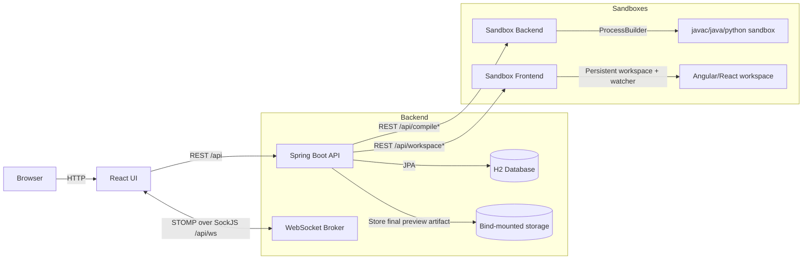

# Architecture

## High-Level Diagram

## Key Flows

### Interview Session
- Interviewer creates a session and receives a join link token.
- Interviewee joins using the token (name/email must match what interviewer registered).
- Live collaboration uses STOMP topics (`/topic/session/{sessionId}`) for code + session state.

### Compile & Run
- Frontend posts Java source to the main backend using the existing `/api/compile` contract.
- Backend proxies Java/Python execution to `sandbox-backend`.
- `sandbox-backend` routes execution through `SandboxExecutionService -> LanguageRunner -> JavaRunner/PythonRunner`.
- The runner writes source to a temp directory, executes inside the isolated sandbox process, and returns stdout/stderr/compile errors to the backend.

### Frontend Workspace Build & Preview
- Angular and React interviews use `sandbox-frontend`.
- Backend creates a persistent workspace per session and reuses it for fast warm builds.
- File changes are patched into the workspace and builds prefer the live watcher path, with direct-build fallback when better diagnostics are needed.
- Preview is exposed during the live session through the sandbox frontend preview route.

### End Interview / Final Preview
- Before a session is marked ended, backend performs one final execution/build using the latest saved code/files.
- For Angular/React, backend downloads the final preview bundle from the live workspace preview route.
- Backend stores that final preview artifact under bind-mounted storage and then cleans up the live frontend workspace.
- Result pages render the stored artifact through `/api/sessions/{id}/final-preview/...`, so the live workspace does not need to remain active.

## Persistence

- H2 is used for sessions, participants, tokens, code state, run results, and feedback.
- Docker deployment uses file-based H2 persisted via bind mount.
- Final identity snapshots and final frontend preview artifacts are stored under the backend bind-mounted storage root.
- `sandbox-backend` remains stateless apart from temporary run directories.
- `sandbox-frontend` keeps only the live session workspace; that workspace is removed after final preview capture and interview shutdown.
