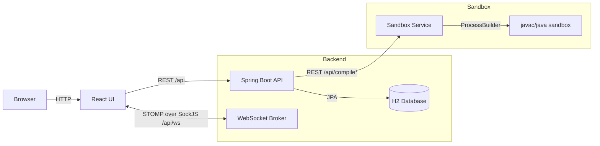

# Architecture

## High-Level Diagram

## Key Flows

### Interview Session
- Interviewer creates a session and receives a join link token.
- Interviewee joins using the token (name/email must match what interviewer registered).
- Live collaboration uses STOMP topics (`/topic/session/{sessionId}`) for code + session state.

### Compile & Run
- Frontend posts Java source to the main backend using the existing `/api/compile` contract.
- Backend proxies compile/run requests to the dedicated sandbox service.
- Sandbox writes the source to a temp directory, compiles via `javac`, and executes via `java`.
- Sandbox captures stdout/stderr/compile errors and returns them to the backend.

## Persistence

- H2 is used for sessions, participants, tokens, code state, run results, and feedback.
- Docker deployment uses file-based H2 persisted via bind mount.
- Sandbox execution is stateless in this phase and keeps only temporary per-run work directories.
