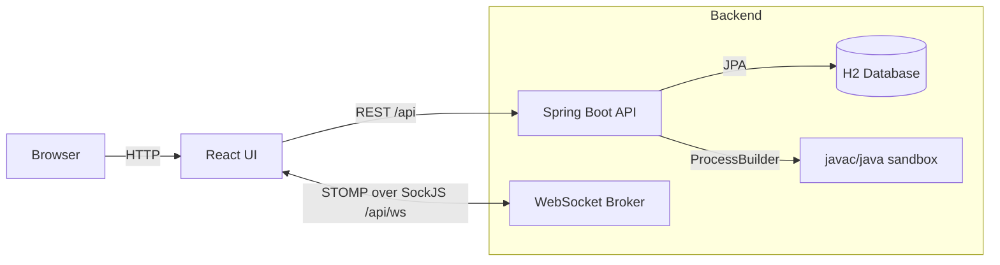

# Architecture

## High-Level Diagram

## Key Flows

### Interview Session
- Interviewer creates a session and receives a join link token.
- Interviewee joins using the token (name/email must match what interviewer registered).
- Live collaboration uses STOMP topics (`/topic/session/{sessionId}`) for code + session state.

### Compile & Run
- Frontend posts Java source to backend.
- Backend writes the source to a temp directory and compiles via `javac`.
- Backend executes via `java` with timeout/memory constraints and captures stdout/stderr.

## Persistence

- H2 is used for sessions, participants, tokens, code state, run results, and feedback.
- Docker deployment uses file-based H2 persisted via bind mount.

