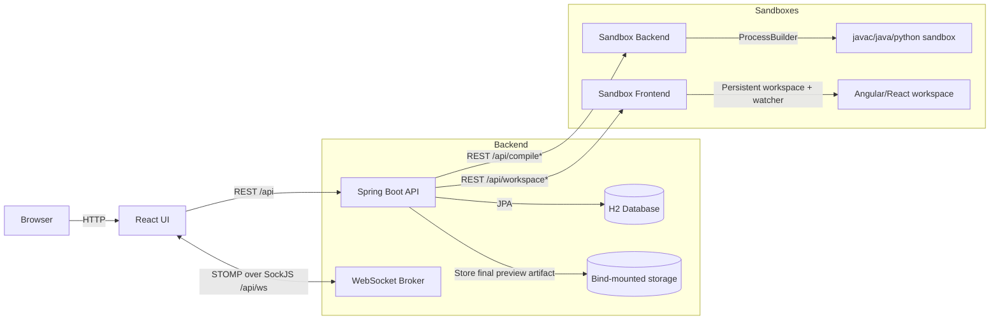

# Architecture

## High-Level Diagram

## Key Flows

### Interview Session
- Interviewer creates a session and receives a join link token.
- During session creation, the interviewer selects the live AV mode for the interview: built-in platform AV or an external channel such as Microsoft Teams or Zoom.
- Interviewee joins using the token (name/email must match what interviewer registered).
- Identity capture remains mandatory before the interviewee enters the live session, regardless of the selected AV mode.
- Before the interviewer starts the live interview, both participants see a non-dismissible quick control guide with a single `I know` action. The guide explains editor buttons and shortcuts while the editor is still read-only.
- Live collaboration uses STOMP topics (`/topic/session/{sessionId}`) for code + session state.
- When `IN_APP` AV is selected, the session also uses WebRTC signaling for the built-in media panel.
- When `EXTERNAL` AV is selected, the coding session remains focused on the editor and session controls while live audio/video is handled outside the platform.

### Compile & Run
- Java/Python interviews support Guided Question Tabs. The interviewer can prepare future hidden tabs at any time while the candidate works on the current active tab.
- Guided question tabs can be deleted only while they are still `Prepared`; active/submitted question evidence is retained in the interview record.
- The candidate submits the current question with `Freeze`; the submitted tab becomes read-only, and the next prepared tab is automatically promoted to active/visible when it exists.
- Guided question tab states are `Prepared`, `Active`, and `Submitted`; submitted tabs are read-only for both participants.
- Frontend posts the active Java/Python question source to the main backend using the existing `/api/compile` contract.
- Backend proxies Java/Python execution to `sandbox-backend`.
- `sandbox-backend` routes execution through `SandboxExecutionService -> LanguageRunner -> JavaRunner/PythonRunner`.
- The runner writes source to a temp directory, executes inside the isolated sandbox process, and returns stdout/stderr/compile errors to the backend.
- Backend stores the latest run evidence per Java/Python question tab so the Result Workspace can review each question independently.

### Frontend Workspace Build & Preview
- Angular and React interviews use `sandbox-frontend`.
- Backend creates a persistent workspace per session and reuses it for fast warm builds.
- Editor builds use Warm Watcher Live Preview: the UI sends changed files with `livePreviewMode=true`, the sandbox patches them into the persistent workspace, and the active framework watcher result is returned without launching a second full build.
- React live-preview failures wait `200 ms` to collect more watcher diagnostics before returning.
- Angular live-preview failures wait `1000 ms` because Angular CLI watcher output can flush diagnostic lines more slowly.
- Final/session-end builds are not treated as live preview; they remain strict so result artifacts are captured only from durable successful builds.
- Preview is exposed during the live session through the sandbox frontend preview route.
- React workspaces are intentionally constrained to `tsx`, `ts`, and `css` files under `src/`, which keeps the Monaco setup and sandbox contract aligned with the supported interview format.

### Integrity Activity Tracking
- Candidate monitoring uses Progressive Integrity Warnings.
- Activity events are stored with a severity: `INFO`, `WARNING`, or `SUSPICIOUS`.
- Backend owns severity classification so websocket updates, persisted results, and refreshes remain consistent.
- First-time paste and drag/drop attempts are warnings; repeated attempts are suspicious.
- In-app AV focus loss is suspicious after `10 seconds` or a repeat occurrence.
- External AV focus loss is initially informational/warning-level and becomes suspicious after `30 seconds` or repeated occurrences, because Teams/Zoom interaction can be legitimate.
- In-app mic/camera disablement is warning-first and becomes suspicious after `15 seconds` or repeated disablement.
- Candidate notifications use corrective language, while interviewer alerts are reserved for confirmed suspicious events.
- The Result Workspace summarizes integrity activity by severity and event category.

### End Interview / Final Preview
- Before a session is marked ended, backend performs one final execution/build using the latest saved code/files.
- For Angular/React, backend downloads the final preview bundle from the live workspace preview route.
- Backend stores that final preview artifact under bind-mounted storage and then cleans up the live frontend workspace.
- Result pages render the stored artifact through `/api/sessions/{id}/final-preview/...`, so the live workspace does not need to remain active.

## Persistence

- H2 is used for sessions, participants, tokens, code state, run results, and feedback.
- Java/Python Guided Question Tabs reuse `code_files` for tab metadata and `run_results` for per-question execution evidence.
- Guided Question Tab state is stored as plain boolean/integer metadata on `code_files` (`enabledForCandidate`, `activeQuestion`, `submitted`, and `idealDurationMinutes`), not as database enums.
- Enum-backed entity fields use `EnumType.STRING`; local/Docker H2 startup runs an enum-column repair pass that converts known enum columns to `VARCHAR` to avoid stale H2 enum allowed-value errors after enum changes.
- Docker deployment uses file-based H2 persisted via bind mount.
- Final identity snapshots and final frontend preview artifacts are stored under the backend bind-mounted storage root.
- `sandbox-backend` remains stateless apart from temporary run directories.
- `sandbox-frontend` keeps only the live session workspace; that workspace is removed after final preview capture and interview shutdown.
