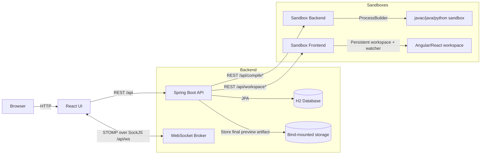

# Architecture

## High-Level Diagram

```mermaid
flowchart LR
  U[Browser] -->|HTTP| FE[React UI]
  FE -->|REST /api| BE[Spring Boot API]
  FE <--> |STOMP over SockJS /api/ws| WS[WebSocket Broker]
  BE -->|JPA| DB[(H2 Database)]
  BE -->|REST /api/compile*| SBB[Sandbox Backend]
  BE -->|REST /api/workspace*| SBF[Sandbox Frontend]
  SBB -->|ProcessBuilder| JVM[javac/java/python sandbox]
  SBF -->|Persistent workspace + watcher| FW[Angular/React workspace]
  BE -->|Store final preview artifact| FS[(Bind-mounted storage)]

  subgraph Backend
    BE
    WS
    DB
    FS
  end

  subgraph Sandboxes
    SBB
    SBF
    JVM
    FW
  end
```

## Key Flows

### Interview Session
- Interviewer creates a session and receives a join link token.
- The registration flow supports two modes: `HUMAN_INTERVIEWER` and `AI_INTERVIEWER`. Human mode is the default and preserves the existing two-person workflow.
- AI mode registers an internal `AI Interviewer` system participant and sends secure access only to the candidate.
- Registration captures experience, target-role, difficulty-level, evaluation-style, and max-question/level metadata for both AI-interviewer and human-interviewer sessions.
- Human-interviewer registration moves live AV mode selection to the follow-up setup step: built-in platform AV or an external channel such as Microsoft Teams or Zoom.
- Interviewee joins using the token (name/email must match what interviewer registered).
- Identity capture is part of the pre-session flow before the interviewee enters the live session, regardless of the selected AV mode.
- Identity capture readiness accepts terminal statuses (`SUCCESS`, `SKIPPED`, or `FAILED`) so a candidate who continues without a photo is still considered joined and ready for interview start.
- Before the interviewer starts the live interview, both participants see a non-dismissible quick control guide with a single `I know` action. The guide explains editor buttons and shortcuts while the editor is still read-only.
- Live collaboration uses STOMP topics (`/topic/session/{sessionId}`) for code + session state.
- When `IN_APP` AV is selected, the session also uses WebRTC signaling for the built-in media panel.
- When `EXTERNAL` AV is selected, the coding session remains focused on the editor and session controls while live audio/video is handled outside the platform.

### AI Service
- AI orchestration is separated into `ai-service/`, a Spring Boot WebFlux service.
- The core backend remains the source of truth for sessions, participants, code files, run results, feedback, and human override.
- `ai-service` owns provider configuration, question generation, solution evaluation, interview recommendation prompts, and later voice/transcript analysis. It supports OpenAI and Gemini behind the `AI_PROVIDER` toggle.
- Provider-specific models are resolved inside `ai-service`: OpenAI prefers `OPENAI_MODEL_*`, Gemini prefers `GEMINI_MODEL_*`, and generic `AI_MODEL_*` values are only backward-compatible fallbacks.
- The service is configured only through environment variables; API keys must not be committed.
- Initial Docker endpoint: `http://localhost:8084/api/ai/status`.
- Live provider-readiness endpoint: `http://localhost:8084/api/ai/status/provider`.
- Backend calls `ai-service` through `AI_SERVICE_BASE_URL` and keeps all generated questions in the existing `code_files` question-tab model.
- For AI interviews, backend secure-access startup calls the provider-readiness endpoint before OTP emails are sent; failed readiness blocks candidate access with a friendly retry message.
- Session-scoped AI operations are exposed by the backend under `/api/sessions/{id}/ai/...`, so the frontend does not need direct provider access.
- AI question progression is candidate-action driven: `Freeze` persists the submitted tab, triggers background AI evaluation, and asks the AI service for the next question. The candidate does not manually request or evaluate AI questions from the interview screen and sees a loading state while generation is in progress.
- Evaluation style controls AI progression. `Standard Multiple Questions` keeps independent question tabs. `Banyan Style` keeps a single evolving Java/Python challenge visible to the candidate, preserves each passed level as hidden submitted evidence, asks the AI service to extend the same challenge with the next requirement/assertions, and blocks further generation if the latest level did not pass.
- Human-interviewer sessions expose an interviewer-only AI Assistant drawer. The drawer stays collapsed as a right-side ribbon with the `Ctrl + Alt + Q` shortcut, drafts validated questions for interviewer review, shows the reference solution only to the interviewer, includes expected complexity and expected solve-time tabs, supports regenerate options for difficulty/section direction, and publishes only the starter question after explicit acceptance.
- Question Policy/Rubric Engine v1 lives in backend Java code (`AiPolicyEngineService`) and sends structured policy/rubric guidance into AI question generation, solution evaluation, and final recommendation requests. This is intentionally a phase 1 implementation; the rules should later move to DB/admin-managed tables so HR/interview owners can tune technology concept coverage, forbidden capabilities, duration guidance, and rubric weights without code changes.
- Per-question AI evaluation is persisted on `code_files`; final AI recommendation metadata is persisted on `interview_sessions` and remains subject to human review/override. Session end also attempts backend-side recommendation generation for AI-interviewer and AI-assisted human-interviewer sessions so the result does not depend on the candidate browser staying open.
- AI-generated Java/Python questions carry stored difficulty level, expected complexity, original problem/test snapshots, hidden reference solution metadata, and integrity notes so evaluation can detect changed problem statements or validation assertions.
- Java/Python AI questions pass through a backend validation gate before persistence: generate problem and hidden solution, verify matching starter/reference assertions, compile/run the hidden solution through `sandbox-backend`, and only then publish the starter question to the candidate. Failed validation triggers regeneration or a validated fallback.
- Human-interviewer accepted AI drafts reuse the same `code_files` tab model and store private reference-solution metadata, so the candidate/editor receives the question only and the result page can still review question evidence.
- Candidate disclaimers make the same rule explicit before entry: changing, removing, or weakening problem statements, validation code, or assert statements is recorded as a question-integrity issue and may be treated as suspicious. Integrity output is intentionally boolean-style (`Healthy: TRUE` / `Healthy: FALSE`) with changed validation details when unhealthy.
- Provider-unavailable fallback uses the `interview_question_bank` table. Startup seeding creates 100 Java/Python entries and the backend selects a technology/difficulty-appropriate unused question when Gemini/OpenAI is unavailable, varying selection by session and avoiding already used question content.

### Compile & Run
- Java/Python interviews support Guided Question Tabs. The interviewer can prepare future hidden tabs at any time while the candidate works on the current active tab.
- Guided question tabs can be deleted only while they are still `Prepared`; active/submitted question evidence is retained in the interview record.
- The candidate submits the current question with `Freeze`; the submitted tab becomes read-only, its solve duration is captured, and the next prepared tab is automatically promoted to active/visible when it exists.
- Guided question tab states are `Prepared`, `Active`, and `Submitted`; submitted tabs are read-only for both participants.
- Frontend posts the active Java/Python question source to the main backend using the existing `/api/compile` contract.
- Candidate `Run Active Tab` presses are persisted as `executeAttemptCount` on the active question tab; Freeze's final capture does not increment this counter.
- Backend proxies Java/Python execution to `sandbox-backend`.
- `sandbox-backend` routes execution through `SandboxExecutionService -> LanguageRunner -> JavaRunner/PythonRunner`.
- The runner writes source to a temp directory, executes inside the isolated sandbox process, and returns stdout/stderr/compile errors to the backend.
- Backend stores the latest run evidence per Java/Python question tab so the Result Workspace can review each question independently.

### Frontend Workspace Build & Preview
- Angular and React interviews use `sandbox-frontend`.
- Backend creates a persistent workspace per session and reuses it for fast warm builds.
- Editor builds use Warm Watcher Live Preview: the UI sends changed files with `livePreviewMode=true`, the sandbox patches them into the persistent workspace, and the active framework watcher result is returned without launching a second full build.
- React live-preview failures wait `200 ms` to collect more watcher diagnostics before returning.
- Angular live-preview failures wait `1000 ms` because Angular CLI watcher output can flush diagnostic lines more slowly.
- Final/session-end builds are not treated as live preview; they remain strict so result artifacts are captured only from durable successful builds.
- Preview is exposed during the live session through the sandbox frontend preview route.
- React workspaces are intentionally constrained to `tsx`, `ts`, and `css` files under `src/`, which keeps the Monaco setup and sandbox contract aligned with the supported interview format.

### Integrity Activity Tracking
- Candidate monitoring uses Progressive Integrity Warnings.
- Activity events are stored with a severity: `INFO`, `WARNING`, or `SUSPICIOUS`.
- Backend owns severity classification so websocket updates, persisted results, and refreshes remain consistent.
- First-time paste and drag/drop attempts are warnings; repeated attempts are suspicious.
- In-app AV focus loss is suspicious after `10 seconds` or a repeat occurrence.
- External AV focus loss is initially informational/warning-level and becomes suspicious after `30 seconds` or repeated occurrences, because Teams/Zoom interaction can be legitimate.
- In-app mic/camera disablement is warning-first and becomes suspicious after `15 seconds` or repeated disablement.
- Candidate notifications use corrective language, while interviewer alerts are reserved for confirmed suspicious events.
- The Result Workspace summarizes integrity activity by severity and event category.
- Question-integrity evidence from tampered prompts, validation code, or assert statements is retained separately from browser/activity events and is considered during AI recommendation and human review.
- In AI-interviewer mode, candidate copy/cut from the editor is blocked and recorded as integrity activity; repeated attempts are elevated to suspicious.

### End Interview / Final Preview
- Before a session is marked ended, backend performs one final execution/build using the latest saved code/files.
- For Angular/React, backend downloads the final preview bundle from the live workspace preview route.
- Backend stores that final preview artifact under bind-mounted storage and then cleans up the live frontend workspace.
- Result pages render the stored artifact through `/api/sessions/{id}/final-preview/...`, so the live workspace does not need to remain active.

## Persistence

- H2 is used for sessions, participants, tokens, code state, run results, and feedback.
- Java/Python Guided Question Tabs reuse `code_files` for tab metadata and `run_results` for per-question execution evidence.
- Guided Question Tab state is stored as plain boolean/integer/timestamp metadata on `code_files` (`enabledForCandidate`, `activeQuestion`, `submitted`, `idealDurationMinutes`, `candidateStartedAt`, `submittedAt`, `solveDurationSeconds`, and `executeAttemptCount`), not as database enums.
- Enum-backed entity fields use `EnumType.STRING`; local/Docker H2 startup runs an enum-column repair pass that converts known enum columns to `VARCHAR` to avoid stale H2 enum allowed-value errors after enum changes.
- Docker deployment uses file-based H2 persisted via bind mount.
- Final identity snapshots and final frontend preview artifacts are stored under the backend bind-mounted storage root.
- `sandbox-backend` remains stateless apart from temporary run directories.
- `sandbox-frontend` keeps only the live session workspace; that workspace is removed after final preview capture and interview shutdown.
